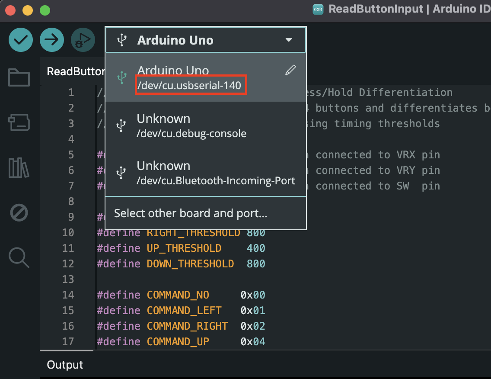

# How the server works

Under ```server.ts``` there is the SerialPort connection code:

```javascript
  ...
  // Create a new serial port instance
  // Note: The port path needs to be adjusted based on your system:
  // - Windows: COM3, COM4, etc.
  // - macOS: /dev/cu.usbserial-140, /dev/tty.usbmodem*
  // - Linux: /dev/ttyUSB0, /dev/ttyACM0
  const port = new SerialPort({
    path: "/dev/cu.usbserial-140", // Update this to match your system's port
    baudRate: 9600, // Must match Arduino's Serial.begin() rate
  });
  ...
```

Replace the ```path``` variable with the arduino connection port that shows up under your Aruino IDE, as shown in the following screenshot:



In my case, when plugged into mhy machine, the Arduino keyboard shows up as ```/dev/cu.usbserial-140```. So this is the value I put under ```path```.

The code would transmit the received action from Arduino as Socket.io signals from PORT 4000.

The following actions are transmitted:

- Button 2-9: Input numbers 2-9 respectively
- Joystick Up: Move selection up
- Joystick Down: Move selection down
- Joystick Left: Delete last digit
- Joystick Right: Clear input
- Button 10/Action Button: Select current suggestion
